> **Epigraph / "Not all days shine brightly, but every single one counts."**

Today is **January 1, 2026** ~~(don't ask why I didn't finish writing this yesterday)~~. Many significant things happened in the past year, **2025**—the end of 11th grade and the arrival of 12th grade, provincial mock exams, city-wide standardized tests... one event after another pushed me forward.

## School Life

> Amidst the high-pressure academic life, small surprises and details from daily life helped me stay grounded.

2025 basically covered the second semester of 11th grade and the first semester of 12th grade. During this time, I achieved many goals but also left behind many regrets.

### Grades

First, my grades from the second semester of 11th grade. Chinese and English were notably ~~(crappy)~~.
Of course, Physics, Chemistry, and Biology maintained their previous level, which met my expectations.

Then came my 12th-grade grades. After removing students from the early admission class, my ranking improved slightly, but overall progress was limited—still need to work hard.
A noticeable improvement is that English and Chinese got better 👌.

### Activities

#### 100-Day Pledge Ceremony (When I Was in 11th Grade)

We held the 100-day pledge ceremony for the seniors. It didn't feel as good as the one during my 10th grade year. It was held during the long break, and many people folded paper airplanes and flew them together at the end.

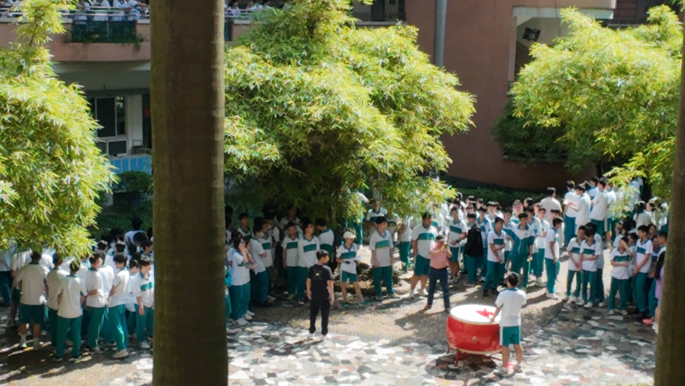

#### Class Basketball Tournament

My athletic ability is practically non-existent, so I didn't participate. However, as the photographer, I managed to capture some photos and videos.
ps: I used CowTransfer to send the files back then, paid for it, and the recipient still failed to receive them.

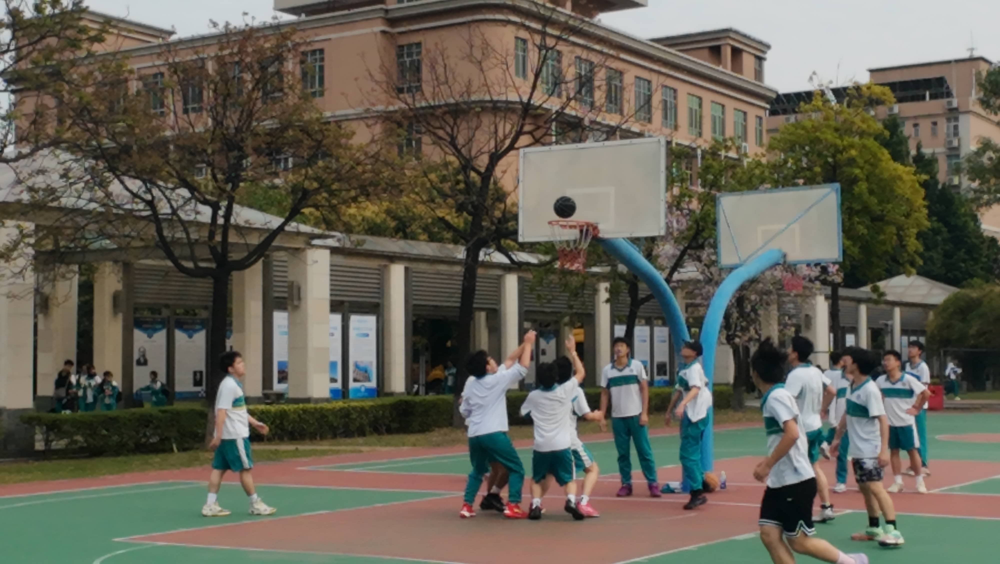

#### English Drama Festival

Our class (Class 4, Grade 11) performed **"The King's New Clothes."**
We won the Grand Prize in the end.
ps: Unfortunately, I didn't participate.

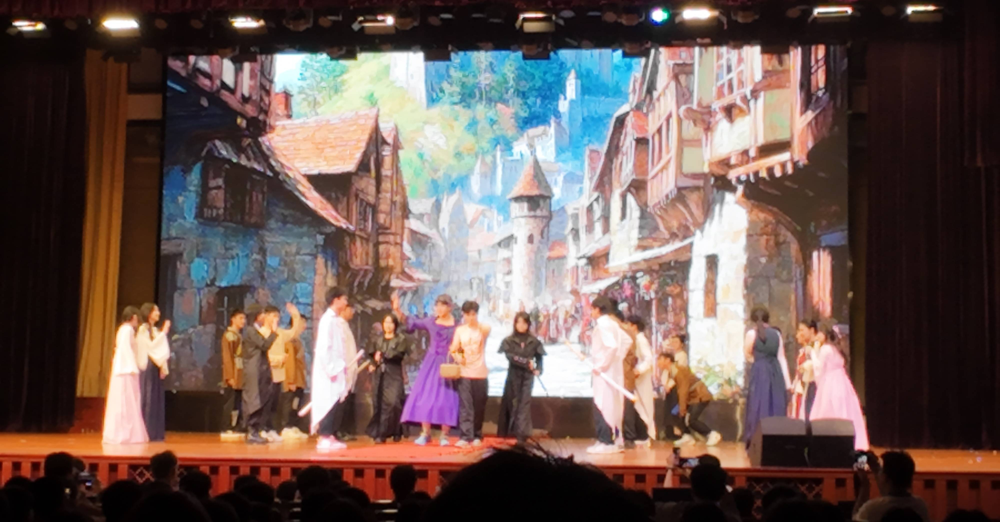

#### School Sports Meet

Our class came in 4th place overall in the team standings. I only participated in the long rope skipping event.

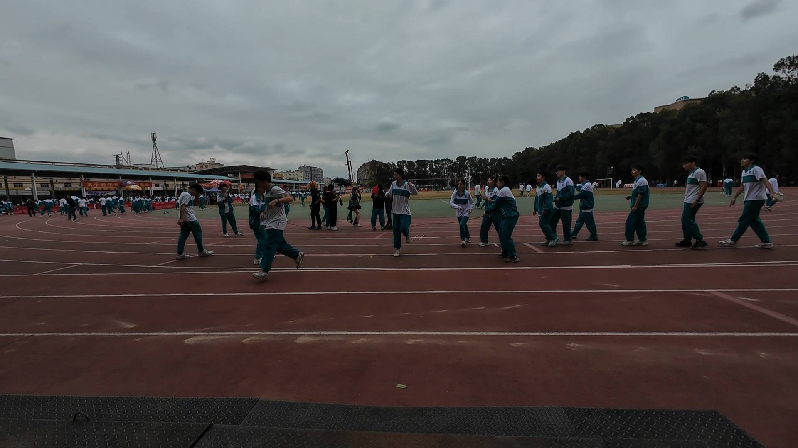

## Daily Life

> Life is filled with many small, happy moments worth recording, like gatherings with friends, late-night thoughts, and occasional travels.

### Travel

This year, I only traveled once, visiting Suzhou, Hangzhou, and Jiaxing in one trip.

#### Jiaxing (Haining)

We stopped in Haining mainly because my childhood friend wanted to visit Wang Guowei's former residence.
Wang Guowei's former residence is located inside the Yanguan Tide Music Amusement Park and requires an entrance ticket. Buying the ticket also meant taking a shuttle bus because it's far from the entrance. The total cost was around 70-80 RMB.
What we saw was a small house filled entirely with replicas. Personally, I found it not worth it at all; even the waterfall at the entrance was more interesting.

#### Suzhou

📍 Route: Lingyan Mountain → Gusu Terrace → Mudu Ancient Town → Canglang Pavilion → Guanqian Street → Pingjiang Road
🍜 Food & Drinks: 1. OT Another Tea 2. Crab Noodle Hall 3. Wuzhentang Black Rice
✂️ Souvenirs: 1. Suzhou Gifts - Postcards 2. Suzhou Museum Gift Shop - "Four Seasons of Su Museum" Postcards 3. Sansheng Youxin - Bookmark 4. Cat's Sky Concept Store (Flagship) - Stamp Collecting Book, Postcards, Stationery Set
🔖 Collected three multi-color stamps. Minimum purchase of 19 RMB required; a bookmark just met it.

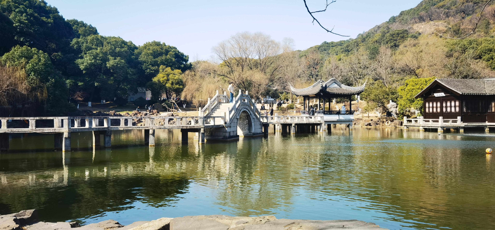

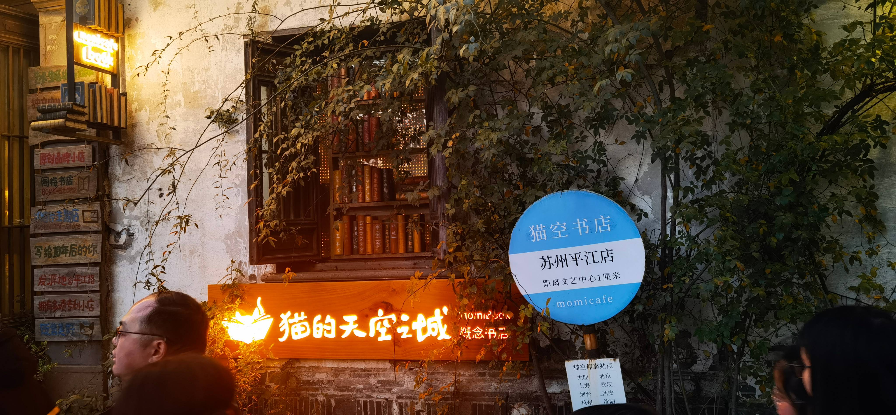

#### Hangzhou

**Hangzhou Zhijiang Cultural Center**
📍 Route: Provincial Museum → Provincial Cultural Center → Provincial Library → Provincial Intangible Cultural Heritage Center
🍜 Food & Drinks: 1. Zhi Ye Tea (2nd floor of Provincial Museum) - Da Hong Pao, Tiramisu (expensive but the only option) 2. Chen Ba Liang Noodle House - Beef Brisket Noodles 3. Yueji·Authentic Shaoxing Cuisine (slightly higher per person cost but great taste)
✂️ Souvenirs: 1. Provincial Museum - "Dwelling in the Fuchun Mountains" Postcards, Longquan Celadon Postcards 2. Provincial Cultural Center - Lu Xun Bookmark
🔖 The consumption-based stamps for the four venues could only be obtained by buying the specific stamp collection book from any one venue. They were both ugly and expensive. (The provincial museum gift shop was very strict with many people; other venues had fewer people, allowing stamps with lower purchase minimums or even for free.)

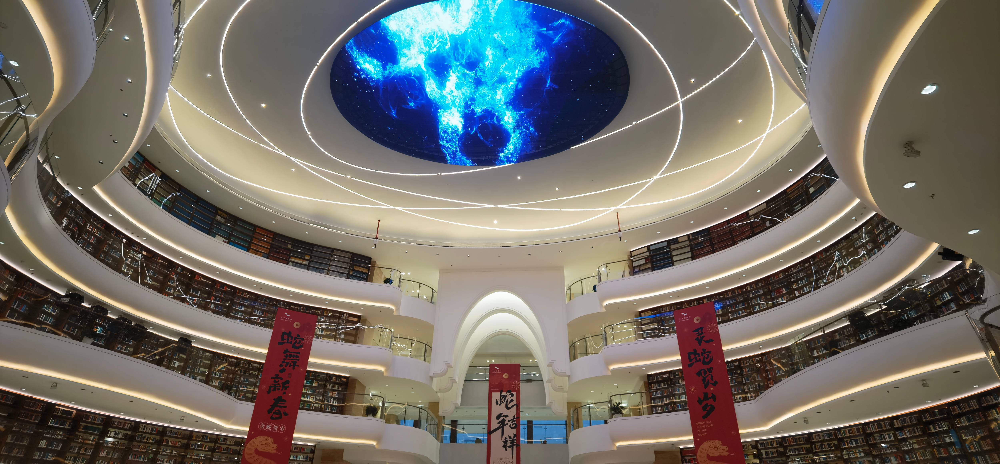

**Hangzhou**
📍 Route: Chaoshan Mountain → Southern Song Imperial Street → West Lake
🍜 Food & Drinks: 1. One Meter Garden (Chaoshan branch) 2. Da'an Hui Style Diguoji (Clay Pot Chicken)
✂️ Souvenirs: Cat's Sky Southern Song Imperial Street Store - Postcards
🔖 Very few plum blossoms were blooming on Chaoshan, but it was quiet with few people and good air. West Lake wasn't too crowded either. Southern Song Imperial Street only had 15 free stamps available at Cat's Sky.

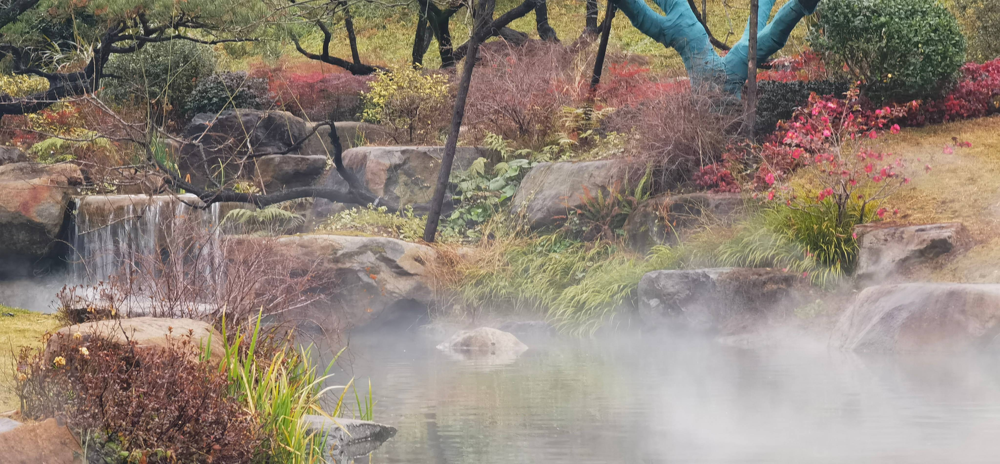

### Events

#### Zenless Zone Zero FES

The second most worthwhile convention I've attended (first place goes to HoyoSummer with its 68 RMB ticket offering everything).
A 298 RMB ticket granted gaming experiences, fan merchandise, an electronic music festival, and a concert.

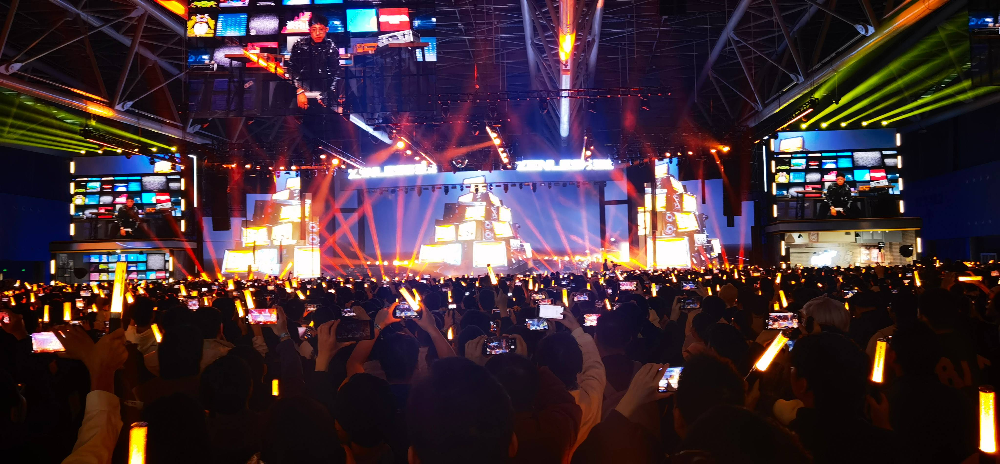

#### Back to Black Coffee Festival 1st Edition

Held at Yuehai Tiandi. It rained early in the morning, and the area was wet everywhere during setup. My friend and I first went to Naixue Tea House to grab a seat and do homework before heading down later.
Since there were no combo tickets or similar deals, prices were a bit high. I tried a cheap Dirty from one vendor—it was average.

#### KASHI Coffee Festival 7th Edition

Bought a 5-cup combo ticket, averaging 28 RMB per special drink—drank to my heart's content.
Birú: Matcha Ice Bōke + Dirty
Rěn Kā: Nut Forest + Pistachio Nut Gelato Single Scoop
Encore Coffee: After the Rain in the Woods
NPC Coffee: Tropical Rainforest (Mango Special 😋)
Monster Unlimited: Post-Smoke Incident with Grapes (Smoked Applewood)
SHIHON HOUSE: Honduras Blend (Siphon Coffee)
Also won a little folding stool (first prize) in Birú's lottery 🌚.

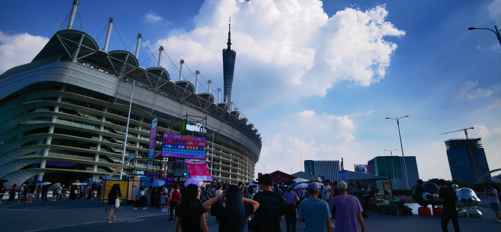

### Hobbies

#### Journaling

I started journaling this year, mainly to record daily life and important events. Sometimes writing really entertains me. It's an activity that allows me to relax amidst the intense studying.

Journaling Supplies
- Solar Human B5 Writing Pad Paper
- King Jim
  - KITTA Storage Can
- Plus DECO RUSH Sticker Decoration Tape
- Hyogensha Memo Pad Samples

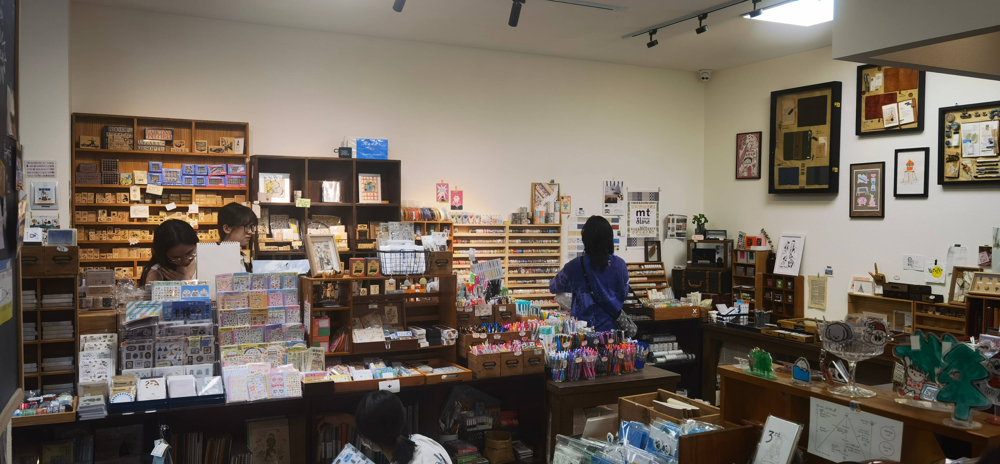

#### Stationery

Acquired a series of new stationery items.
- Fountain Pens
  - Bai Jia Laboratory Year of the Snake Limited EF Nib
  - Bai Jia Laboratory "Iron Horse, Frozen River Enters Dreams" 10th Anniversary Limited
  - Faber-Castell Loom EF Nib
  - Jinhao 58 EF Nib
  - Platinum Preppy EF Nib
- Inks
  - Noodler's Apache Sunset
  - Noodler's Heart of Darkness (Commonly used non-pigment black)
  - Diamine Honey Burst
  - Diamine Cherry Sunburst
  - Diamine Pelham Blue
  - Tono & Lims Santorini
  - Tono & Lims Shakespeare
- KACO KEFILL Asian Standard Refills (Who else but KACO pampers me with 0.45 ST refills?)
- Pilot ILMLY Erasable Color-Changing Gel Pen
- Uni-ball Zento Coastal Blue, Canary Yellow, Slate Grey
- Pentel
  - Multi+8 Multi-Colored Mechanical Color Pencil
  - Furoshiki Pen
  - CURX Sanrio Limited - Snoopy
- Zebra
  - Blen Sanrio Limited - Snoopy
- TOME Second-Generation Problem-Solving Pen (Great for practice problems, official price 4 RMB each, cheaper elsewhere)
- Hili A4 Clipboard Folder
- Tombow Air 6 Correction Tape
- Schneider MAXX220 Highlighter (Really good)
- Maruman
  - KURUFIT A5 Loose-Leaf Notebook
  - Seion B5 Loose-Leaf Notebook
- Kokuyo
  - Field Notes Book
  - Mini Loose-Leaf Notebook
  - ERIC Collaboration Gel Pen
  - Side-Opening Pencil Case
- Seed Sneaker Eraser
- 3M Post-it Notes
- KUTSUWA
  - 10cm Short Ruler (Zero line at the edge, a masterpiece)
- Ozumon Pouch Pencil Case

### Friend Gatherings

#### Classmate Get-Togethers

**August 29th**

Went to an arcade and played Switch for two hours.
"Suijū Kaiten Boomerang" is really a great party game; up to six people can play.

**October 3rd**

Ordered a whole box of barbecue skewers to the dorm, plus dumplings, sour fish soup, and Heytea.

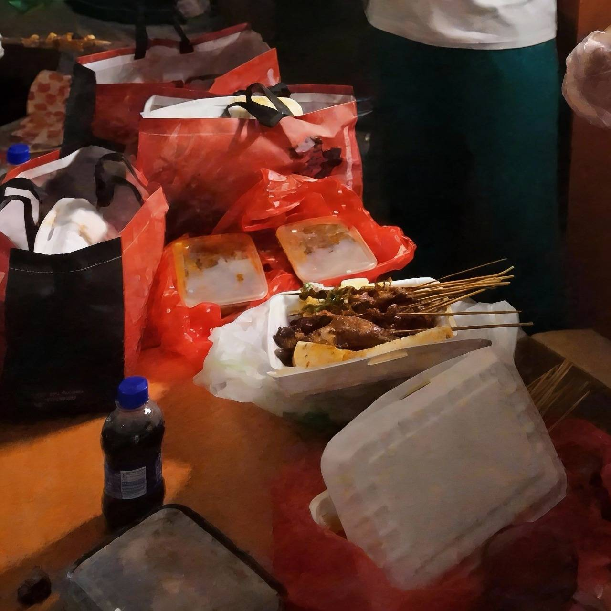

## Digital Life

> Cyberspace is not just a refuge for entertainment, but also an extension of my perception.

### AI

This year, I registered for [Linux Do](https://linux.do), which opened the door to tinkering with AI. Things like early model leaks and reviews can be found on L 站.
However, my current application of AI is mainly focused on learning and some programming. I haven't delved much into deeper Agents. I'll continue exploring in the new year.

1. DeepSeek
   After DeepSeek went viral on January 21st due to DeepSeek-R1, I also topped up 10 RMB to try it. Its understanding within the Chinese context was indeed far ahead at the time. Even though later models from Doubao and Zhipu advanced further, I still use it for writing assistance and providing examples for argumentative points.
2. Zhipu ChatGLM
   Zhipu was indeed behind initially, but after GLM-4 came out, it visibly found its direction. The free calls for GLM-4-Flash were also a brilliant move, attracting many users to Zhipu. GLM-4.5's Agent and special optimizations for programming also pioneered the trend of alternatives，初步突破了 the high wall built by Authropic.
3. OpenAI
   To be honest, I didn't have much contact with OpenAI this year because DeepSeek sufficed for Chinese contexts. However, the groundbreaking leads of Sora2 and GPT-4o were truly eye-opening.

### Gaming

Spent basically the whole year playing Zenless Zone Zero, interspersed with Minecraft and some games on Steam.

### Deployments

Tinkering was really the main theme of this year.

- [Openlist](https://oplist.org)
- [Ech0](https://ech0.app)
- [qinglong](https://qinglong.online)
- [message-pusher](https://github.com/songquanpeng/message-pusher)
- [gotify](https://gotify.net)

## Epilogue

In 2025, I was like a clumsy captain, simultaneously piloting three small boats—school, digital, and daily life—sailing in their respective seas,going the distant, shimmering light. Storms were frequent, but the feeling of holding the helm felt good.

In the newly begun 2026, I hope I can maintain a good mindset, advance towards the short-term goal of the college entrance exam, and prepare for greater ambitions.

**2026, here I come!**