> **题记 / “并不是所有的日子都闪闪发光，但每一个日子都算数。”**

今天是 **2026 年 1 月 1 日** ~~（不要问为什么不在昨天写完）~~，过去的**2025 年**有很多重要的事情发生———高二结束和高三到来、省 0 模、市统测，一件件事情推着我往前走

## 学校生活

> 高压的学习生活中，一些生活中的小惊喜和小细节让我可以保持平静。

2025 年基本覆盖了了高二下学期和高三上学期，在这段时间里，完成了很多目标，也留下了很多遗憾

### 成绩

首先就是高二下的成绩，很突出的就是语文和英语 ~~（粪）~~  
当然，物化生也确实依旧保持之前的水准，这点符合我的预期

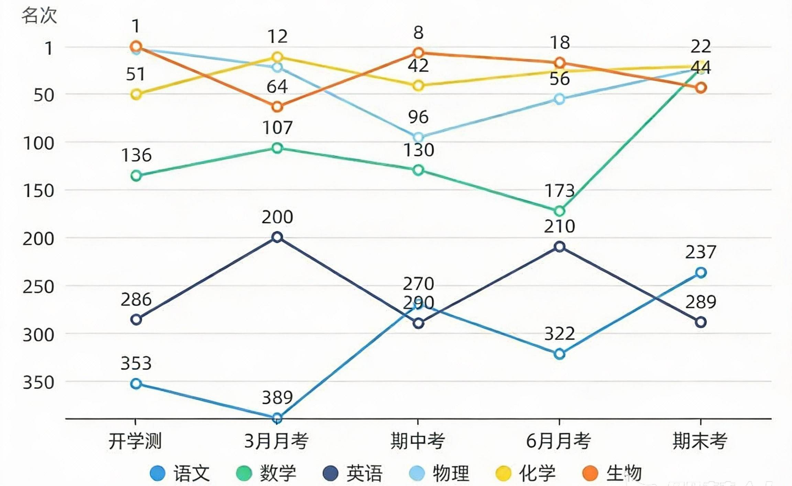

然后就是高三的成绩，在去除去报送班的同学后，看着排名是往前了一点，但总体提升不大，仍然需要努力  
可见的是英语和语文好起来了👌

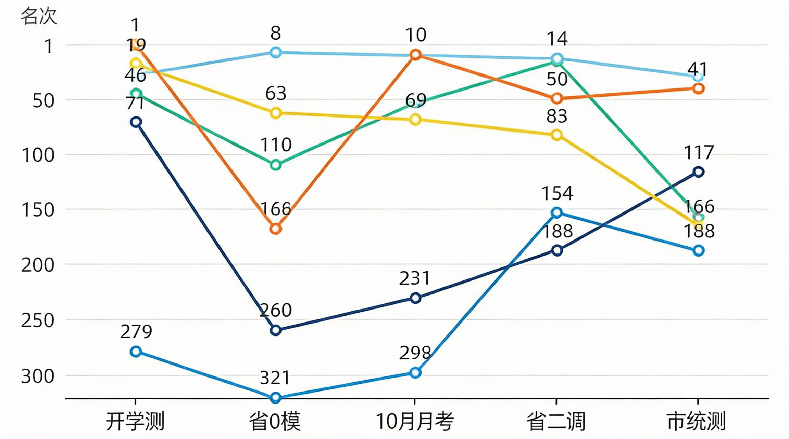

### 活动

#### 高二时的百日誓师

给高三举办百日誓师，感觉没高一时的好，大课间举行的，很多人都折了纸飞机最后一起飞了

#### 班级篮球赛

我的运动细胞近乎于无，所以没有参加，不过作为摄影师还是拍到了一些照片和视频的  
ps: 当时传文件用了奶牛快传，花了钱最后接收端还失败了

#### 英语戏剧大赛

我们班（高二 4 班）的节目是 **《The King's New Clothes》**（即国王的新衣）  
最后拿了特等奖  
ps: 很遗憾我没有参加

#### 校运会

我们班好像是团体总分第四，我就参加了个跳大绳

## 日常生活

> 生活中有很多小确幸值得记录，比如和朋友们的聚会、深夜的思考、偶尔的旅行。  

### 旅游

今年只出去旅游了一次，一次性去了苏州、杭州和嘉兴

#### 嘉兴

去海宁中转了一下，主要是发小想去看王国维故居。  
王国维故居被围在了盐官潮乐之城，还需要买门票，买了门票又因为里门口很远大概率是要做摆渡车的，总体还需要花费 70~80 元  
看到的就是一个全是复制本的小房子，个人觉得是很不值的，甚至不如看这门口的瀑布

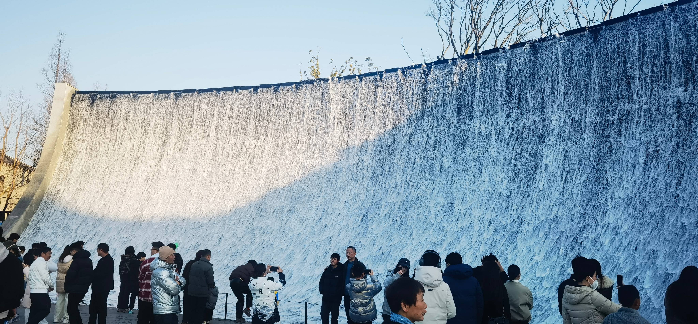

#### 苏州

📍路线：灵岩山→姑苏台→木渎古镇→沧浪亭→观前街→平江路  
🍜吃喝：1. OT 另茶 2. 蟹面堂 3. 吴珍堂乌米饭  
✂️​文创：1. 苏州礼物 - 明信片 2. 苏州博物馆文创店 - 苏博四时景明信片 3. 三生有信 - 书签 4. 猫的天空之城总店 - 集章本、明信片、信纸套装  
🔖​集到了三个套色章，要求低消 19，一个书签刚好

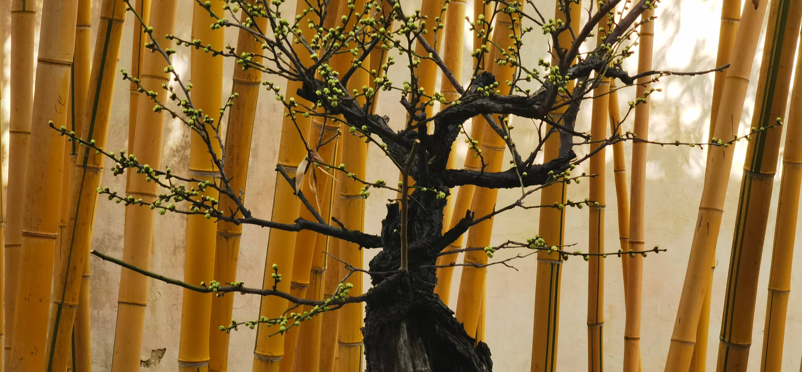

#### 杭州

**杭州之江文化中心**
📍路线​：省博物馆→省文化馆→省图书馆→省非遗文化馆  
🍜吃喝：1. 省博二楼之也茶 - 大红袍、提拉米苏 (贵但只有它) 2. 陈八两面家 - 牛展面 3. 越稽·地道绍兴菜馆 (人均略高但味道好)  
✂️文创：1.  省博 - 富春山居图明信片、龙泉青瓷明信片 2. 省文化馆 - 鲁迅书签  
🔖​四馆的消费章一定只能买任一馆的集章本才行，又丑又贵 (省博文创店很多人很严格，其他馆人少可以低消甚至免费盖)

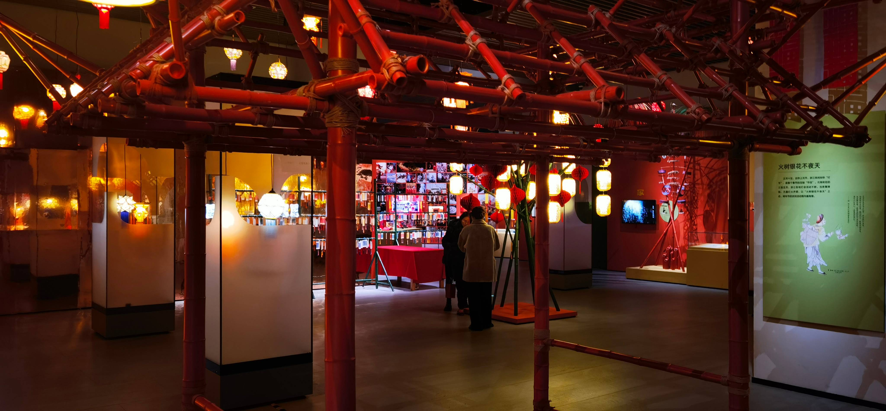

**杭州**
📍​路线：超山→南宋御街→西湖  
🍜吃喝：1. 一尺花园 (超山店) 2. 大俺徽地锅鸡  
✂️文创：猫空南宋御街店 - 明信片  
​🔖超山梅花开的很少但少人且空气好，西湖人也不是很多，南宋御街只有猫空还有 15 个免费章

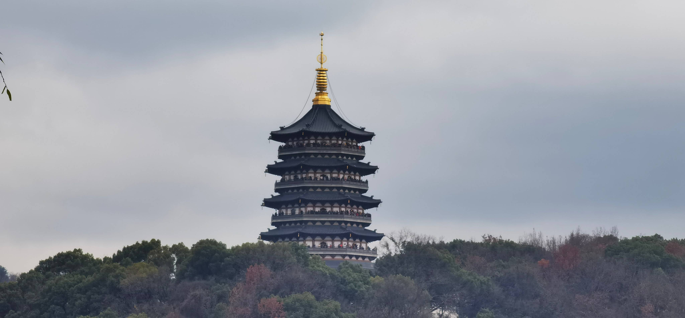

### 活动

#### 绝区零 FES

去过第二值的漫展（第一是 68 门票要啥有啥的 HoyoSummer）  
298 的门票，有游玩体验，有同人周边，有电音节，有演唱会  

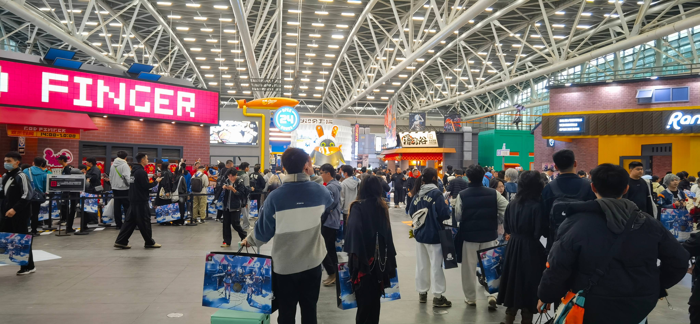
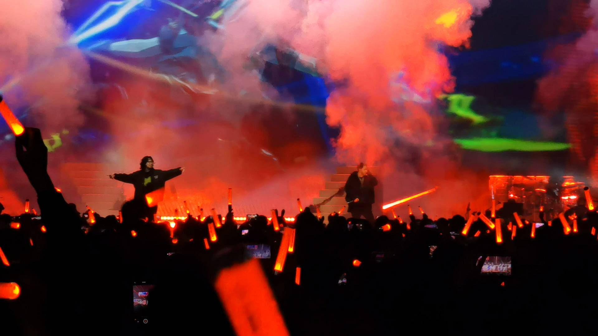

#### 回归纯粹咖啡节 1th

在粤海天地举行的，凌晨下了雨，最开始布展的时候到处都是水，我是和朋友先去了奈雪茶院占位写作业，后面下去的  
因为没有套票之类的，所以价格偏贵，我试了家便宜的 Dirty，中规中矩

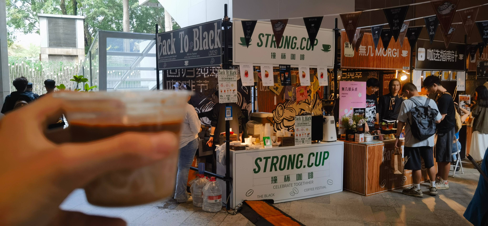

#### 咖势 7th

​买了 5 杯 套票，平均一杯 28 特调喝到爽  
​必如：抹茶冰薄克 + Dirty  
​忍咖：坚果森林 + 开心果坚果碎 Gelato 单球  
Encore 谙客咖啡：雨后林间  
​NPC Coffee：热带雨林 (芒果特调😋)  
怪兽无限：萄不掉的事后烟 (烟熏苹果木)  
​SHIHON HOUSE：洪都拉斯拼配 (虹吸咖啡)  
必如那抽奖还​抽到小马扎（头奖）🌚  

### 爱好

#### 手帐

今年开始了手帐，主要是用来记录每天的生活和一些重要的事情，有时写写真的可以娱乐自己，算是在紧张的学习中的一个可以放松自己的活动

手帐用品
- 太阳能人 B5 拍纸本书写纸
- 锦宫
  - KITTA 收纳罐
- 普乐士 DECO RUSH 贴纸修饰带
- 表现社 便签分装

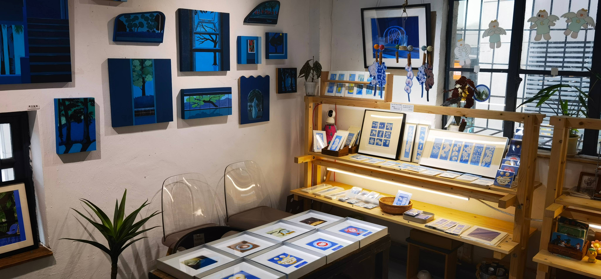

#### 文具

购入了一系列的新文具
- 钢笔
  - 败家实验室 蛇年限定 EF 尖
  - 败家实验室 铁马冰河入梦来 十周年限定
  - 辉柏嘉 翎尚 EF 尖
  - 金豪 58 EF 尖
  - 白金 小流星 EF 尖
- 墨水
  - 鲶鱼 阿帕奇晚霞
  - 鲶鱼 永恒黑（常用非碳素黑墨）
  - 戴阿米 爆裂蜂蜜
  - 戴阿米 樱桃日落
  - 戴阿米 佩勒姆蓝
  - 坛水 圣托里尼
  - 坛水 莎士比亚
- KACO KEFILL 亚规笔芯（除了 KACO 谁宠我给我出 0.45 的 ST 笔芯啊）
- 百乐 ILMLY 可擦变色钢珠笔
- 三菱 Zento 海岸蓝、金丝雀黄、板岩灰
- 派通
  - Multi+8 多色自动彩铅
  - 浮游笔
  - CURX 三丽鸥限定 - 史努比
- 斑马
  - Blen 三丽鸥限定 - 史努比
- TOME 刷题笔二代（很好用的刷题笔，官方 4 块一只，其他渠道更便宜）
- 喜利 A4 板夹文件夹
- 蜻蜓 Air 6 修正带
- 施耐德 MAXX220 记号笔 (真的好用)
- 满乐文
  - KURUFIT A5 活页本
  - 清音 B5 活页本
- 国誉
  - 野账本
  - mini 活页本
  - ERIC 联名中性笔
  - 横开笔袋
- Seed 鞋面橡皮
- 3M 便利贴
- KUTSUWA
  - 10cm 短尺（0 刻度线在边上，神作）
- 小津制 Pouch 笔袋

### 朋友聚会

#### 同学团建

**8 月 29 日**

去电玩店打了两小时 Switch  
随动回旋镖真是个聚会好游戏，能六个人玩

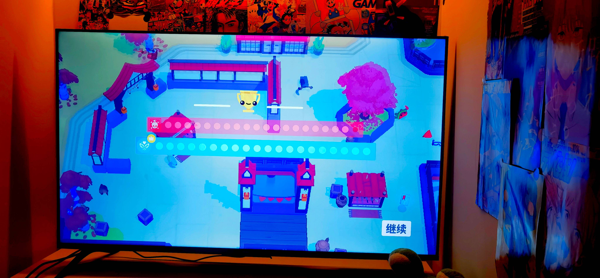

**10 月 3 日**

在宿舍点了一箱的烧烤、还有饺子、酸菜鱼、喜茶

## 赛博生活

> 赛博空间不仅是娱乐的避风港，更是我延伸感知的触角。

### AI

今年注册了 [Linux Do](https://linux.do) 算是打开了 AI 折腾的大门，像是新模型偷跑、测评都可以在 L 站找到  
但是目前对 AI 的应用主要集中在辅助学习，部分编程，更深层的 Agent 还是没有多少接触，新的一年继续探索吧

1. DeepSeek
   DeepSeek 在 1 月 21 号因为 DeepSeek-R1 爆火之后，我也充了 10 块钱试试，他在中文语境的理解在当时确实是遥遥领先的，即便后面豆包、智谱出的模型更进一步，但在写作协助、论点句的举例上依旧会使用它
2. 智谱 ChatGLM
    智谱在最开始确实落后，但 GLM-4 出来后，可见的找准了方向，GLM-4-Flash 的免费调用也是一步秒棋，给 智谱拉了不少用户，GLM-4.5 的 Agent 还有编程方面的特别优化也是开创了平替浪潮，初步突破了 Authropic 搭建的高墙
3. OpenAI
    实话说，这一年我真的没怎么接触 OpenAI，因为中文语境用 DeepSeek 就够了，不过 Sora2 和 GPT-4o 这两个开创性的领先确实让人眼前一新

### 游戏

整年基本上都在打绝区零，还有穿插着 MC 和以下 Steam 上的游戏

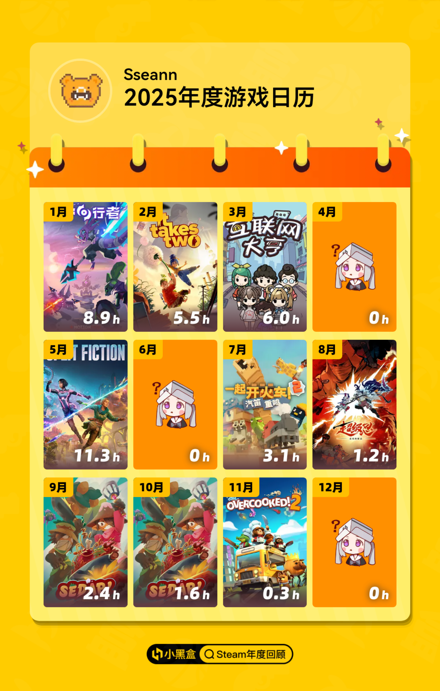

### 部署

折腾真的是这一年的主基调

- [Openlist](https://oplist.org)
- [Ech0](https://ech0.app)
- [qinglong](https://qinglong.online)
- [message-pusher](https://github.com/songquanpeng/message-pusher)
- [gotify](https://gotify.net)

## 结语

2025 年的我，像一个笨拙的船长，同时驾驶着学校、赛博与日常三艘小船，在各自的海域里，努力划向微光闪烁的远方。风浪常有，迷惘常在，但掌舵的感觉，真好。

在刚刚开始的 2026 年，希望我可以保持良好的心态，为了短期的高考目标前进，为了更远大的目标积蓄力量

**2026，我来了！**