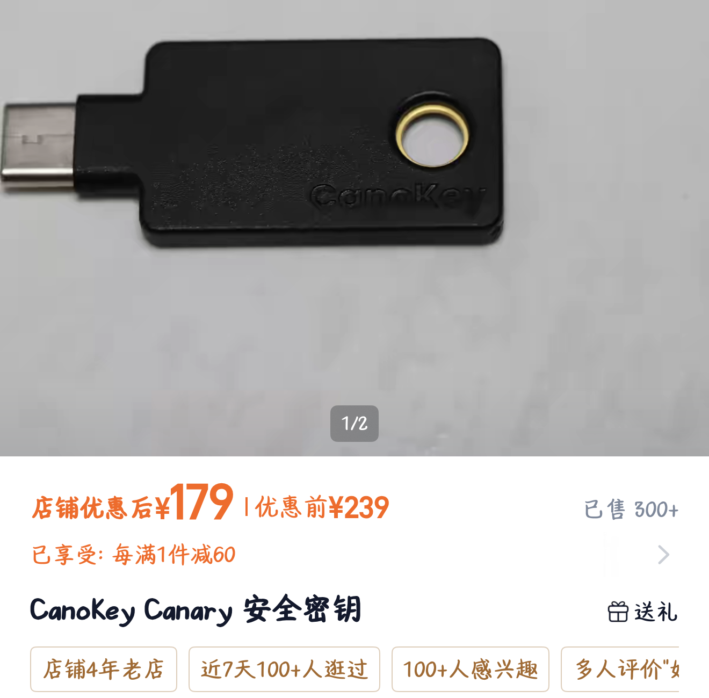

## 前言

Canokey Canary 是一款国产硬件安全密钥，支持 FIDO2、OpenPGP、PIV、OTP、NDEF

前几个月的时候我就购入了这个密钥，但是因为即将高考，所以没有时间写这一篇记录（而且 OpenPGP 的 Git 签名我现在才弄好）

## 购买

直接在淘宝官方店铺 Canokeys 购买即可，价格大概在 200 元以下（固件为3.0.3正式版）



## 初始化

先根据进行初始化，更改默认 PIN ，以下是需要更改的参考表：

| PIN 名称          |  默认值  | 说明                                                         |
| :---------------- | :------: | :----------------------------------------------------------- |
| Admin PIN         |  123456  | 用于管理 CanoKey 上的不同应用，如重置应用、修改NDEF配置等。  |
| FIDO2 PIN         | 无默认值 | 部分强制使用 PIN 的 FIDO2 应用会询问此口令。FIDO2 PIN 没有预设值。用户在首次使用强制 PIN 的 FIDO2 应用时会收到设置 FIDO2 PIN 的提示，此时用户可以自己设置该 PIN。 |
| OpenPGP PIN       |  123456  | 用于常规 OpenPGP 操作，如 OpenPGP 签名等。                   |
| OpenPGP Admin PIN | 12345678 | 用于 OpenPGP 应用的管理操作。例如，在 CanoKey 上生成 OpenPGP 密钥对，或者修改 OpenPGP 密钥属性时，会需要该 PIN。 |
| PIV PIN           |  123456  | 用于常规 PIV 操作，例如 PIV 身份认证、通过 PKCS#11 调用 PIV 进行签名等。 |
| PIV PUK           | 12345678 | 用于在 PIV PIN 被锁定后解锁 PIV PIN。                        |

在电脑 (Windows、Mac、Linux) 上需要使用 [网页控制台](https://console.canokeys.org) 进行设置，主要是更改 Admin PIN 

在安卓手机上需要使用 [Canokey Console](https://play.google.com/store/apps/details?id=org.canokeys.console) 进行设置，插入后打开 App 就可以使用和网页几乎一致的页面进行设置（所以可以当 OTP 的查看器用）

在 iOS 上，因为苹果的接口问题，只能使用 NFC 进行连接和调试（我没有苹果手机不太清楚界面）

## WebAuthun (PassKey)

Canokey Canary 支持 FIDO2/WebAuthn 协议，可以作为 PassKey 使用

可以参考 [这个网站](https://2fa.directory/int/) 查找支持硬件密钥的网站，也就是 Hardware 那一栏

在我的实际体验中，我主要存储了以下网站的 Passkey ，主要分为 MFA 或无密码登录两种

|             | MFA                       | No Password     |
| ----------- | ------------------------- | --------------- |
| Self-Hosted |                           | Ech0、Bitwarden |
| Cloud       | Aliyun、Tencent           | Aliyun、Tencent |
| Application | Telegrams、Notion、Feishu |                 |
| Account     | Google                    | Microsoft       |
| Coding      | Github、Vercel            | Github、Vercel  |

在 Windows11 上，当你在网站点击添加通行密钥后，就会弹出一个窗口，可以选择保存 Passkey 在 Iphone/IPad/Android 上、硬件密钥上或者使用 PIN 保存在电脑上，选择硬件密钥，输入管理 PIN 并触摸 Canokey 就可以把 Passkey 存储在Canokey上了

之后在登录时选择使用硬件密钥登录，输入管理员PIN并触摸Canokey就可以登录了

## OpenPGP

Canokey Canary支持作为 GnuPG 的智能卡，可以存储身份验证、签名、加密密钥，所以可以实现例如对 Git 提交进行签名、对邮件进行加密等功能，我只使用了 Git 签名功能，其他尚未尝试

首先，在 Windows 下，安装 [Gpg4win](https://gpg4win.org/get-gpg4win.html) 是使用 GnuPG 的最简单方式，他是Windows下的一整套GnuPG工具且自带 Kleopatra 这个图形化管理界面，在下载时，选择 $0 就可以直接下载

下载完成后可以打开 Kleopatra ，点击菜单栏的“智能卡”就可以看到 Canokey Canary 了，在里面可以设置 PIN 和 管理员PIN

接下来的操作建议还是使用 Powershell 直接通过命令行进行操作

### 生成主密钥

```powershell
gpg --expert --full-gen-key
```

这一步会出现十几个选项，分别对应不同的加密算法，这里推荐使用 ECC 加密算法

```powershell
(11) ECC (set your own capabilities)
Your selection? 11
```

下一步会让你选择主密钥的功能，这里选择只保留 Certify 功能，其他功能使用子密钥

```powershell
(S) Toggle the sign capability
Your selection? s
```

然后会再次询问，输入 q 保存设置进入下一步，提示选择算法曲线，这里选择 Curve 25519

```powershell
(1) Curve 25519 *default*
Your selection? 1
```

接下来是选择主密钥的有效时间，为防止意外，推荐设置10年以内，防止由于个人原因遗失后不可控

```powershell
Key is valid for? (0) 10y
Key does not expire at all
Is this correct? (y/N) y
```

接下来会让你输入个人信息，因为这里作 Git 签名用途，最好使用自己 Github 绑定的邮箱（Comment 不用填，直接 Enter）

```powershell
Real name: Sean
Email address: sseaan@example.com
Comment:
You selected this USER-ID:
    "Editst <editst@example.com>"

Change (N)ame, (C)omment, (E)mail or (O)kay/(Q)uit? o
```

接下来会弹出窗口输入密码，注意一定要保管好！！！

### 生成子密钥

输入```gpg --fingerprint --keyid-format long -K``` 会提示只有一个 Certify 的主密钥，fingerprint 为 787E848E1A98D086

```
[keyboxd]
------------------------------------------------
sec   ed25519/787E848E1A98D086 2022-01-01 [C]
      Key fingerprint = 6869 7537 A54B 1F0B FC05  E1D9 787E 848E 1A98 D086
uid                 [ultimate] Sean <sseaan@example.com>
```

用三个命令分别生成三个子密钥（E、A、S） fingerprint 为主密钥的 fingerprint

```powershell
gpg --quick-add-key <fingerprint> cv25519 encr
gpg --quick-add-key <fingerprint> ed25519 auth
gpg --quick-add-key <fingerprint> ed25519 sign
```

再次输入```gpg --fingerprint --keyid-format long -K```

```powershell
[keyboxd]
------------------------------------------------
sec   ed25519/787E848E1A98D086 2022-01-01 [C]
      Key fingerprint = 6869 7537 A54B 1F0B FC05  E1D9 787E 848E 1A98 D086
uid                 [ultimate] Editst <editst@example.com>
ssb   ed25519/055917609C9C0D7B 2022-01-01 [S] [expires: 2024-01-01]
      Key fingerprint = E99F 3D15 7ACF 7E24 3DC8  FFE7 0559 1760 9C9C 0D7B
ssb   ed25519/05F4A6C335157258 2022-01-01 [A] [expires: 2024-01-01]
      Key fingerprint = C4B9 7EEC 4060 F856 7A4D  2956 05F4 A6C3 3515 7258
ssb   cv25519/C5B8214C3AD21C6C 2022-01-01 [E] [expires: 2024-01-01]
      Key fingerprint = E39E E067 3233 BD73 7ED1  15F1 C5B8 214C 3AD2 1C6C
```

上面生成了三种功能的子密钥（ssb），分别为加密（E）、认证（A）、签名（S），对应 `OpenPGP Applet` 中的三个插槽。由于 `ECC` 实现的原因，加密密钥的算法区别于其他密钥的算法。

加密密钥用于加密文件和信息。签名密钥主要用于给自己的信息签名，保证这真的是来自**我**的信息。认证密钥主要用于 SSH 登录。

### 备份

```gpg -ao public-key.pub --export 787E848E1A98D086```

然后分别导出各个私钥，请务必备份好，**特别是主密钥和吊销证书**，建议多介质异地备份。同时记得备份之前自动生成的吊销证书：`%APPDATA%\gnupg\openpgp-revocs.d\68697537A54B1F0BFC05E1D9787E848E1A98D086.rev`。

注意 `key id` 后面的 `!`，表示只导出这一个私钥，若没有的话默认导出全部私钥。注意子密钥对应的名称，不要顺序错误

```powershell
gpg -ao sign-key.asc --export-secret-key 055917609C9C0D7B!
gpg -ao auth-key.asc --export-secret-key 05F4A6C335157258!
gpg -ao encr-key.asc --export-secret-key C5B8214C3AD21C6C!
```

具体备份策略可以参照以下

> - 主密钥只保留一份，建议备份在一个全盘加密的U盘中，然后放在一个绝对安全的地方。
> - 子密钥可以复制多份，通过U盘导入各个设备，专密专用，日常使用推荐用智能卡（比如Yubikey），还能免去每次输密码的麻烦
> - 撤销凭证可以和主密钥放在一起备份一份， 另外单独备份一份（这样丢失密钥，起码还可以撤销）

### 导入Canokey

之后把各个子密钥导入对应插槽，请注意，这步是**不可逆**的，一但私钥导入智能卡并保存，**本地私钥会被删除**，无法再次恢复，因此务必确认已经正确完善备份

如果你使用了多个 Canokey，想同时向其中导入子密钥，请注意最后一步**不要保存**，直接强行退出，然后更换另一枚 Canokey 或其他智能卡，重复操作即可

```
gpg --edit-key 787E848E1A98D086
gpg (GnuPG) 2.3.4; Copyright (C) 2021 g10 Code GmbH
This is free software: you are free to change and redistribute it.
There is NO WARRANTY, to the extent permitted by law.

Secret key is available.

sec  ed25519/787E848E1A98D086
     created: 2022-01-01  expires: never       usage: C
     trust: ultimate      validity: ultimate
ssb  ed25519/055917609C9C0D7B
     created: 2022-01-01  expires: 2024-01-01  usage: S
ssb  ed25519/05F4A6C335157258
     created: 2022-01-01  expires: 2024-01-01  usage: A
ssb  cv25519/C5B8214C3AD21C6C
     created: 2022-01-01  expires: 2024-01-01  usage: E
[ultimate] (1). Sean <sseaan@example.com>

gpg> key 1 # 首先选中第一个子密钥

gpg> keytocard
Please select where to store the key:
   (1) Signature key
   (3) Authentication key
Your selection? 1 # 选择对应插槽

# 首先输入 OpenPGP 的密码，再输入 OpenPGP Applet 对应的 Admin PIN
# 之后先反选 key 1，再依次选择 key 2，key 3，重复操作即可

gpg> key 1
gpg> key 2
gpg> keytocard
Please select where to store the key:
   (3) Authentication key
Your selection? 3
gpg> key 2
gpg> key 3
gpg> keytocard
Please select where to store the key:
   (2) Encryption key
Your selection? 2

gpg> save # 保存修改
```

这时再次查看 Canokey 状态，确认导入成功

```
gpg --card-status
```

可以看到此时子密钥标识符为 `ssb>`，表示本地只有一个指向 `card-no: F1D0 xxxxxxxx` 智能卡的指针，已不存在私钥。现在可以删除掉主密钥了，请**再次确认你已安全备份好主密钥**。

```
gpg --delete-secret-keys 787E848E1A98D086
```

为确保安全，也可直接删除 gpg 的工作目录：`%APPDATA%\gnupg`，Linux/macOS: `~/.gunpg`。

### 使用 Canokey

此时切换回日常使用的环境，首先导入公钥

```
gpg --import public-key.pub
```

然后设置子密钥指向 Canokey

```
gpg --edit-card
gpg/card> fetch
```

此时查看本地的私钥，可以看到已经指向了 Canokey

```
gpg --fingerprint --keyid-format long -K
[keyboxd]
------------------------------------------------
sec#  ed25519/787E848E1A98D086 2022-01-01 [C]
      Key fingerprint = 6869 7537 A54B 1F0B FC05  E1D9 787E 848E 1A98 D086
uid                 [ultimate] Seab <sseaan@example.com>
ssb>  ed25519/055917609C9C0D7B 2022-01-01 [S] [expires: 2024-01-01]
      Key fingerprint = E99F 3D15 7ACF 7E24 3DC8  FFE7 0559 1760 9C9C 0D7B
      Card serial no. = F1D0 xxxxxxxx
ssb>  ed25519/05F4A6C335157258 2022-01-01 [A] [expires: 2024-01-01]
      Key fingerprint = C4B9 7EEC 4060 F856 7A4D  2956 05F4 A6C3 3515 7258
      Card serial no. = F1D0 xxxxxxxx
ssb>  cv25519/C5B8214C3AD21C6C 2022-01-01 [E] [expires: 2024-01-01]
      Key fingerprint = E39E E067 3233 BD73 7ED1  15F1 C5B8 214C 3AD2 1C6C
      Card serial no. = F1D0 xxxxxxxx
```

### Git Commit 签名

首先确保 Git 本地配置以及 GitHub 中的邮箱信息包含在 `UID` 中，然后设置 Git 来指定使用子密钥中的签名（S）密钥。

```
git config --global user.signingkey 055917609C9C0D7B
```

之后在 `git commit` 时增加 `-S` 参数即可使用 gpg 进行签名。也可在配置中设置自动 gpg 签名，此处不建议全局开启该选项，因为有的脚本可能会使用 `git am` 之类的涉及到 `commit` 的命令，如果全局开启的话会导致问题。

```
git config commit.gpgsign true
```

如果提交到 GitHub，前往 [GitHub SSH and GPG keys](https://github.com/settings/keys) 添加公钥。此处添加后，可以直接通过对应 GitHub ID 来获取公钥：```https://github.com/<yourid>.gpg```

### 设置公钥 URL

受限于存储空间，OpenPGP 智能卡虽然不能保存公钥，但是可以存储一个公钥的 URL，在其它电脑上使用时，可以让 gpg 通过 url 获取公钥，然后就能使用智能卡了。

上一部分将公钥上传到 Github 获得的链接 ```https://github.com/<yourid>.gpg```

输入 gpg --edit-card 进入智能卡编辑模式，然后输入 admin 启用管理员命令

（或者使用 Kleopatra 直接设置公钥链接）

输入 url 来设置公钥地址，会要求 Admin PIN。

在其它电脑上使用智能卡，只需要将 key 插入，然后 gpg --edit-card，输入 fetch 获取公钥，gpg 将自动下载和导入公钥，并将私钥指向智能卡。

### 常见问题

#### 找不到密钥

有可能在进行 Commit 时会出现这个报错：

```powershell
gpg: skipper "************": NO secret key
gpg: signing failed: NO secret key
error: gpg failed t0 sign the data
fatal: failed tO write commit object
```

可能是没有找到正确的gpt.exe文件位置，通过以下指令可以进行手工指定

```git config --global gpg.program "X:\{SOMEPATH}\Gnupg\bin\gpg.exe"```

我在遇到这个问题使用这个办法之后就可以正常提交，Push 后也能显示 Verified 了

#### 不要直接在智能卡上生成密钥

OpenPGP 智能卡自己可以生成密钥，但是在卡上生成的密钥无法取出，不能进行备份，所以不建议直接在卡上生成密钥，而是在电脑上生成密钥备份好后转移到智能卡中。

转移密钥到智能卡会将本地保存的密钥删除，智能卡中的密钥将无法取出，在继续之前请确保已经备份了密钥

需要智能卡支持要转移的密钥使用的算法

## OTP

不建议使用 Canokey 来存储 OTP ，添加麻烦还不好查看，使用自部署的 Vaultwarden之类的比这方便得多

在网页端点+号就可以通过截屏、扫码和手动输入的方式添加，还不支持 Steam ，仅支持 TOTP/HOTP

## NDEF（NFC 标签）

模式：默认为读写模式，可在控制台中修改
内容：默认为 URL，值为 “[https://canokeys.org](https://canokeys.org/)”
最大长度：1022 字节

可以使用一些能对 NFC 标签进行读写的软件对其进行编辑，比如 NFC Tools

NDEF 信息是明文信息，没有加密，不要存储重要信息

## 公钥交换

我将我的公钥上传到 [OpenPGP 密钥服务器](https://keys.openpgp.org/search?q=sseaan%40outlook.com) 了，可以用我的公钥加密右键/文本，这样我接受到就可以解密了😋

## 结语

其他操作诸如使用 OpenPGP密钥签名邮件、进行SSH登录验证都还没有尝试（主要是用不上）

但上述几种用法就已经覆盖安全密钥的主要使用场景了，希望这一篇上手记录对观看的人有帮助
